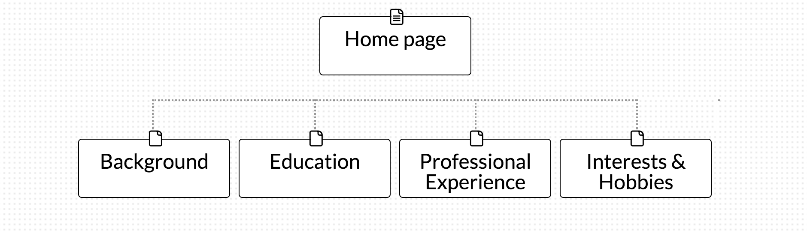

## What are the 6 Phases of Web Design?

 The 6 Phases of Web Design are

 1. Information Gathering
 2. Planning
 3. Design
 4. Development
 5. Testing and Delivery
 6. Maintenance

## What is your site's primary goal or purpose? What kind of content will your site feature?

My site's primary goal is give brief summary about myself. The content will be a collection of information about my background, education and professional experience.

## What is your target audience's interests and how do you see your site addressing them?

My target audience is recruiters, people who are interested in hiring me :smile:. Their interests are my level of experience and my expertise in technology. My site will provide good summary of my skills and also serve as my demonstration of those skills.

## What is the primary "action" the user should take when coming to your site? Do you want them to search for information, contact you, or see your portfolio?

Cantact me, search for information and probably check social profiles.

## What are the main things someone should know about design and user experience?

## What is user experience design and why is it valuable?

## Which parts of the challenge did you find tedious?
