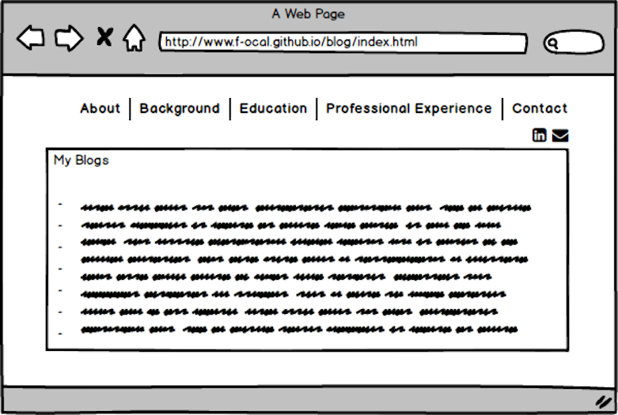

## What is a wireframe?

Wireframe is a sketch of your website without any colors, shading or fonts. It is the basic visual representation of elements on a website.

## What are the benefits of wireframing?

It is really important part of the web design process. It establishes the hierarchy of information on the website which lets you map out where most important elements will go such as sign up button. It helps to simplify the communication between the designer and client. Wireframe is kind of act as a blueprint when you start the design portion of the project that make it easier to plan the layout and the interaction of the interface.

## Did you enjoy wireframing your site?

Yes, I did. It was very fun also brainstorming process to create my site’s wireframe.

## Did you revise your wireframe or stick with your first idea?

After exploring the wireframe, I slightly revised it. The target audience of my website is recruiters, so I plan the layout of the site accordingly.

## What questions did you ask during this challenge? What resources did you find to help you answer them?

I wasn’t really sure what tool might be good for wireframe. After reading through some feedback and experience, I  decided to use one tool to draw the layout of my website.

## Which parts of the challenge did you enjoy and which parts did you find tedious?

It was challenging at first to crack the idea and start making the skeleton of the site.  However while I listed the important elements, thought about user experience design, I start enjoying it and kept improving.
