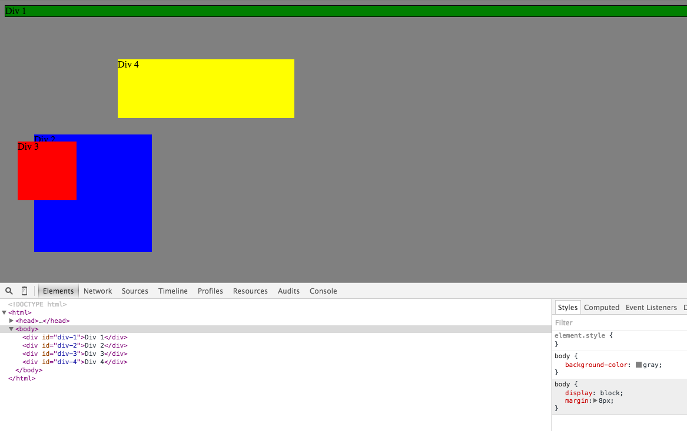

# 3.4 Chrome Dev Tools

<figcaption style="text-align:center">fig. 1. Change colors</figcaption> 

<figcaption style="text-align:center">fig. 2. Column</figcaption> 

<figcaption style="text-align:center">fig. 3. Row</figcaption> 

<figcaption style="text-align:center">fig. 4. Make Equidistant</figcaption> 

<figcaption style="text-align:center">fig. 5. Squares</figcaption> 

<figcaption style="text-align:center">fig. 6. Footer</figcaption> 

<figcaption style="text-align:center">fig. 7. Header</figcaption> 

<figcaption style="text-align:center">fig. 8. Sidebar</figcaption><b>

<figcaption style="text-align:center">fig. 9. Get Creative</figcaption> 

1. How can you use Chrome's DevTools inspector to help you format or position elements?

    Chrome Dev Tools which is bundled within the browser can speed up HTML/CSS workflow. It became very popular among web designers and developers due to the its speed, ease of use, and immediate effective results. When we open DevTools on the browser (shortcut is Shift+Command+C on Mac),you can click the Inspect Element Button at the top of the DevTools window. The 'Elements' pane lets you see everything in the document object model (DOM), dynamic and language-neutral interface.The greatest feauture of the inspector tool is that as you hover over a DOM element, it will highlight the relevant tag on the web page you are viewing. 

    The 'Styles' pane shows the CSS rules that applied to the element. You can easily edit, remove or overlap any applied rules on the element, even more you can can apply new rules.
    Last defined rules take presedence if cascade rule dictates that both rules have same origin, weight, and specificity.
    Understanding how cascading and inheritance works is essential to debugging and formating your style.

2. How can you resize elements on the DOM using CSS?

    Inspector can let you find the elements, CSS ID or classess very easily. You can edit the HTML of the DOM by double clicking on them. Elements can be resized by changing the width and height. Width and height can be calculated and displayed by indicating the measurements in inches, pixels (absolute) or percentage (relative).

3. What are the differences between Absolute, Fixed, Static, and Relative positioning? Which did you find easiest to use? Which was most difficult?

    Absolute positioning lets you determine an element's location by specifying left, right, top and bottom position in pixel, ems or percentages, whoes computed position property is absolute. Absolute positioning allows you to remove an object from the typical flow of the document and place it at a specific point on the page. Absolutely positioned elements are completely detached from the flow of the page, thus takes up no space when placing other elements. Absolute behaves like fixed except the absolute positioned element is positioned relative to nearest positioned ancestor(no statis). If an absolutely position element has no position ancestors or if parent element is position static, the abosultely-positioned child would escape, it will use the document body and move out as you scroll the page up and down. Note that even if there were other content occupying this absolute position, the absolute positioned element wouldn’t care. When something has absolute positioning applied, it neither affects nor is affected by other elements in the normal flow of the page.

    Fixed positioning is that an element is locked into place on the screen. When you scroll the page, fixed elements remain onscreen as photos, paragraphs disappear. Fixed elements are great to creat a fixed side bar or lock a navigation bar to the top or bottom of the page. (versus Static content scrolls with the page)

    Static positioning simply means the content follows the normal top-down flow of HTML. The default position value for any element on the page is 'static'. An element with position: static; is not positioned in any special way. A static element is said to be not 'positioned', 'positioned' element means its position is set to anything except static.

    Relative positioning is that the relatively positioned element is placed relative to its current position in the HTML flow. Setting the top, right, bottom and left properties of a relatively positioned element will cause it to be adjusted away from its normal position. Unlike with absolute positioning, other page elemets accommodate the old HTML placement of a relatively positioned element. Notice that, just as with absolute positioning, the relatively positioned object doesn't care about other items in the normal flow of the page. However, moving an element with relative positioning leaves a "hole" where the element would have been.

4. What are the differences between Margin, Border, and Padding?

    The spacing-out elements such as margin, border and paddington can be easily viewed and changed within the panel. Margin is the spacing outside of something and padding is the spacing inside of something.
    The border helps you increase the space inside a visible box. In the Box Model, you will have an element surrounding that you have padding, then surrounding with the border, and surrounding with the margin.
    The differences between padding and margin is that margins auto-collapse; however padding doesn't. This can be very useful for the spacing between elements.
    The other differences is that padding is included within the click-region and background color/image.

5. What was your impression of this challenge overall? (love, hate, and why?)

    I find Dev Tools very interesting and useful. It may sometimes be difficult to display what exactly you want right away, you may need to edit other elements or attributes. I think the tool is very good for debugging CSS. By being able to inspect which styling rules are being applied to the element by the browser, we are able to find the root of the problem and rectify the bug.
