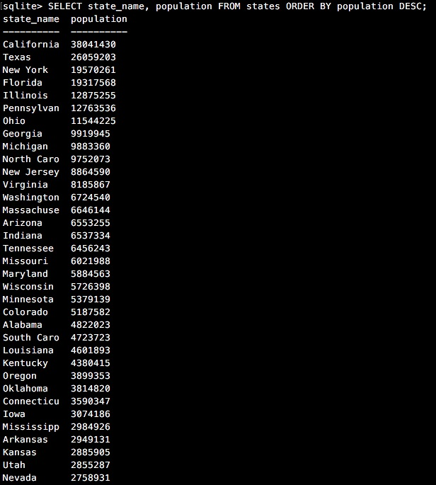
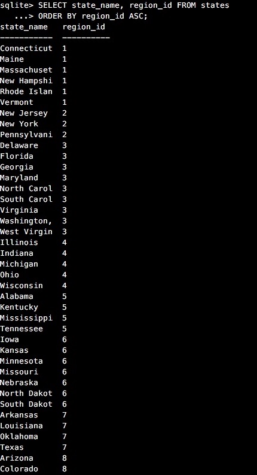

# 8.4. Introduction to Database Schemas and SQL

## My Own Schema

My schema has two tables : persons and outfits. Persons table include data values into the columns of `person_name`, `gender`, `height`, `weight`, `outfit_id`. Outfits table has `casual`, `night-out`, `smart casual`, `sportswear`. This type relationship called one-to-many relationship since one outfit can be owned by only one person. I designed `persons` table that stores information about persons (name, height etc..) with `outfit_id` as the foreign key. Outfits table is designed that information about the clothes where `id` as the primary key. Both `outfit_id` and `id` have the same value. <em>Note:</em> A foreign key of a child table (outfits) is a primary key of a parent table (persons), used to reference the parent table.

Two tables are linked with outfit_id where primary and foreign keys join both tables. You can adapt this schema for many people by including persons information to each person.

### Release 7:  <EM>Reflections</EM>

##### What are databases for?
  A database is the place that you can store data in a structured way so that it can be easily searched and accessed in the future.

##### What is a one-to-many relationship?
  For example, a teacher may teach zero or more classes, while a class is taught by only one teacher. This kind of relationship is called one-to-many. To support one-to-many relationship, we need to design two tables: a table Teachers, that stores information about teachers with teacher

##### What is a primary key? What is a foreign key? How can you determine which is which?
  Primary key serves as unique identifier for each row or record in a given table. A relational database should have only and one primary key. By specifying that the `id` column is the  primary key. None of the values in this column are NULL.

  Foreign Key is column that contains the primary key of another table in the database. We use primary and foreign keys to connect rows in two different tables. One table's foreign key holds the value of another table's primary key. Unlike primary keys, foreign keys do not need to be unique and can be NULL.

##### How can you select information out of a SQL database? What are some general guidelines for that?
  To to select, retrieve and query information from database, you can use various commands in following examples in Virus Predictor. Please see below commands

## Virus Predictor

We have two tables: states and regions.

### Schema Design for Virus Predictor
  

### SELECTing Data from a Database

Let's use SQL to query information from the database.

* To open up SQLite shell type `sqlite3 file_name.sqlite3`
* To view the schema for the database type `.schema`
* To view the tables that exists, type `.tables`
* To view the table information, type `PRAGMA table_info(table_name);`
  For instance, to view states table information, we can type `PRAGMA table_info(states);` . You can also see the data type for each data values that being stored. The output is 

  

* To exit from SQLite shell, type `.exit`.

Note that SQL doesn't print out very nicely in the terminal automatically.  Let's make it fancy then :ok_hand: Open the terminal and type the following:

`cat << EOF > ~/.sqliterc` 
`.headers on` 
`.mode column` 
`EOF`

1. Select all data for all states. 

  * type `SELECT * FROM states;` in the terminal and the output is 
 
  

2. Select all data for all regions. 

    * type `SELECT * FROM regions;` in the terminal and the output is 
 
    

3. Select the `state_name` and `population` for all states.

  * type `SELECT state_name, population FROM states;` in the terminal and the output is 
 
  

4. Select the `state_name` and `population` for all states ordered by population. The state with the highest population should be at the top. <em>Note:</em> `DESC` is descending order (high to low), `ASC` is ascending order (low to high).

  * type `SELECT state_name, population FROM states ORDER BY population DESC;` in the terminal and the output is 
 
  

5. Select the `state_name` for the states in region 7.

  * type `SELECT state_name FROM states WHERE region_id == 7;` in the terminal and the output is 
 
  

6. Select the `state_name` and `population_density` for states with a population density over 50 ordered from least to most dense.

  * type  
  `SELECT state_name, population_density FROM states` 
  `WHERE population_density > 50` 
  `GROUP BY population_density;` in the terminal and the output is 
 
  

7. Select the `state_name` for states with a population between 1 million and 1.5 million people.

  * type  
  `SELECT state_name FROM states` 
  `WHERE population` 
  `BETWEEN 1000000 AND 1500000;` in the terminal and the output is  
 
  

8. Select the `state_name` and `region_id` for states ordered by region in ascending order.

  * type  
`SELECT state_name, region_id FROM states` 
`ORDER BY region_id ASC;`in the terminal and the output is  
 

9. Select the `region_name` for the regions with "Central" in the name.

  * type  
`SELECT region_name FROM regions` 
`WHERE region_name LIKE '%Central%';` in the terminal and the output is  
 

10. Select the `region_name` and the `state_name` for all states and regions in ascending order by `region_id`. Refer to the region by name. (This will involve joining the tables).

  * type
  `SELECT regions.region_name, states.state_name
  FROM states
  JOIN regions ON states.region_id = regions.id
  ORDER BY region_id ASC;` in the terminal and the output is 
 

