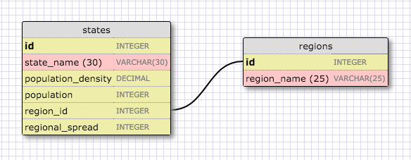

# 8.4 Introduction to Database Schemas and SQL

## Virus Predictor

We have two tables: states and regions.

### Schema Design for Virus Predictor
  

### SELECTing Data from a Database

Let's use SQL to query information from the database.

* To open up SQLite shell type `sqlite3 file_name.sqlite3`
* To view the schema for the database type `.schema`
* To view the tables that exists, type `.tables`
* To view the table information, type `PRAGMA table_info(table_name);`
  For instance, to view states table information, we can type `PRAGMA table_info(states);` and the output is 

  

* To exit from SQLite shell, type `.exit`.

Note that SQL doesn't print out very nicely in the terminal automatically.  Let's make it fancy then :ok_hand: Open the terminal and type the following:

`cat << EOF > ~/.sqliterc` 
`.headers on` 
`.mode column` 
`EOF`

1. Select all data for all states. 

  * type `SELECT * FROM states;` in the terminal and the output is 
 
  

2. Select all data for all regions. 

    * type `SELECT * FROM regions;` in the terminal and the output is 
 
    

3. Select the `state_name` and `population` for all states.

  * type `SELECT state_name, population FROM states;` in the terminal and the output is 
 
  

4. Select the `state_name` for the states in region 7.

  * type `SELECT state_name, FROM states WHERE region_id == 7;` in the terminal and the output is 
 
  

5. Select the `state_name` and `population_density` for states with a population density over 50 ordered from least to most dense.

  * type  
  `SELECT state_name, population_density FROM states`               `WHERE population_density > 50` 
  `GROUP BY population_density;` in the terminal and the output is 
 
  

<!-- REFLECTION

What are databases for?
 A database is the place that you can store data in a structured way so that it can be easily searched and accessed in the future.

What is a one-to-many relationship?

What is a primary key? What is a foreign key? How can you determine which is which?
Primary key is
Foreign Key is

How can you select information out of a SQL database? What are some general guidelines for that? -->
