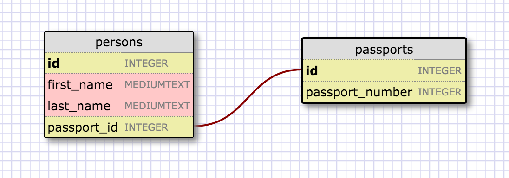
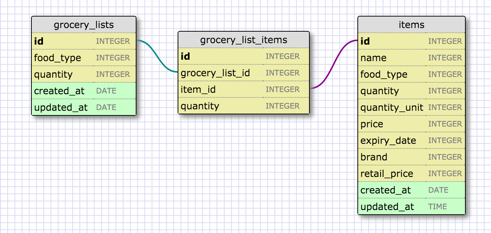

# 8.5. More Schema

### One-to-one Relationship

One-to-One (1-1) relationship is defined as the relationship between two tables where both the tables should be associated with each other based on only one matching row. This relationship can be created using Primary key-Unique foreign key constraints. As you can see from below schema, a person can have only one passport therefore this is perfect case to build a 1-1 relationship also the relationship

### Many-to-many Relationship

Here, we have groceries and items tables with join table. Both tables can have multiple instances. More descriptive variables can improve the efficiency of the usage if we are going to build an app. For instance, 1 unit 6-pack of soda so the quantity is 1 and quantity_type is 6-pack (6 cans pack) or 1 loaf of bread.

### Release 6:  <EM>Reflections</EM>

##### What is a one-to-one database?
  One-to-One (1-1) relationship is defined as the relationship between two tables where both the tables should be associated with each other based on only one matching row. Furthermore, a one-to-one relationship in a relational database occurs when one parent record (field) has either zero or one child record only. These relationships are the easiest to represent in databases because both the parent and child records may be in the same table.

##### When would you use a one-to-one database? (Think generally, not in terms of the example you created).
  You could use a one-to-one relationship to split the data into two tables. One-to-one relationship is also useful for storing certain sensitive data in a secure table, while the non-sensitive ones in the main table. For instance, in the `customers` table in a bank’s database, each customer is represented by a unique `customer_id`, which is also the table’s primary key. Each customer may also have a government issued social security card, which contains a unique social security number. Therefore, each customer must have a single customer ID in the bank’s database. If a customer does have one, then there can only be one `social security number` per customer. The parent field (customer_id) has a one-to-one relationship with the `social security field`.

##### What is a many-to-many database?
  We may need multiple instances on both sides of the relationship. For example, each order can contain multiple items. And each item can also be in multiple orders. When you have many-to-many relationship you will use another table to join two tables. A join table connects the two independent tables by keeping track of the two ids or foreign keys.

##### When would you use a many-to-many database? (Think generally, not in terms of the example you created).
  For instance, You can have many-to-many database to organize things such as you can have teachers and courses tables. Both tables can have multiple instances such as a teacher can teach course and a course can be taught by multiple teachers.

##### What is confusing about database schemas? What makes sense?
  It wasn't confusing much, I am excited to implement these schema into code which might be confusing at that time.
